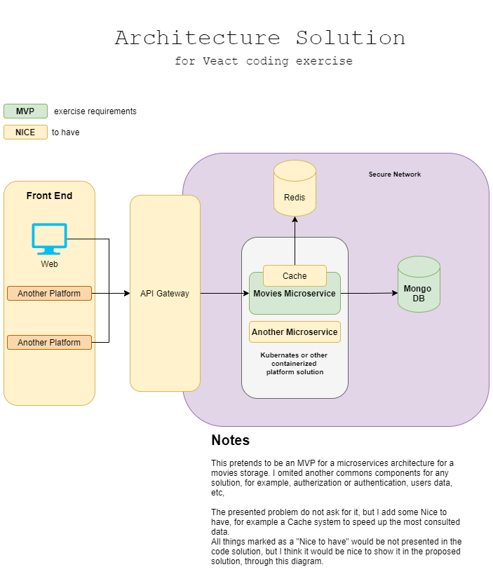

# Movies Microservice

Project of Veact for management of the favorites movies of the team.

## Overview

This is a solution for a movie database with a microservice restful architecture to handle
some operation over the movie data. This microservice it's built with Spring Boot.

## Introduction

The solution is presented with an MVP with the core components needed, but also it's defined the roadmap for an evolution of it.

This a coding exercise proposed by Veact. Thanks for the challenge ;P

### API Swagger

  You can check the API swagger at the endpoint: TBD

### Requirements - What do you need before starting

  0. A good coffee or something similar that make you happy.
  1. Just for local testing *Docker compose* installed in your machine, or a Container Platform to build and deploy it.
  2. Cloning this repository.

The microservice itself would need:

    - Java JDK 1.8 or superior.
    - Maven (Optional, it's included a maven wrapper).
    - Mongo Database

### Instruction to run the mongo with docker:

  1.  In the base directory run:
      
      ``docker-compose up``
      
      this will start a mongo for testing local. 

### Installation for developers
    
1. Clone the repository
   
        git clone https://github.com/Kailcor/movies-microservice-coding-exercise.git

### Compilation 

As any Spring Boot project it has a Maven Wrapper, so you can build it without maven
    
    ./mvnw clean install

### About the API.

  With this microservice you would be able to:
  - Get the data for a specific title.
  - Insert new movies in the database.
  - List all the movies available, filtering them if you want by year.
